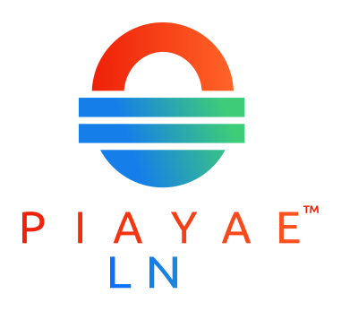

<p align="center">
  <a href="https://privacysafe.link"></a>
</p>

# PrivacySafe Link &ndash; Secret &amp; Secure Notes

PrivacySafe Link is a privacy-focused, encrypted note-sharing service built with React and Golang. Leveraging Redis for data handling and client-side encryption for security, PrivacySafe Link ensures that your notes remain confidential and secure until they are meant to be seen.

## Features

- **Self-destructing notes**: By default notes are deleted automatically after being viewed once.
- **Time-based expiration**: Notes can be set to expire after a custom number of time.
- **View-based expiration**: Notes can be set to expire after a custom number of views.
- **Redis + client-side encryption**: Utilizes Redis for in memory data storage and retrieval, combined with client-side encryption to ensure that the server never has access to the contents of the notes.

## Free Public Server

Browse to https://privacysafe.link to try this software for free.

## Getting Started

### Configuration

To configure AetherNote properly, set the following environment variables. Below is a table describing each variable and its function:

| Variable                 | Description                                           | Possible Values                      |
|--------------------------|-------------------------------------------------------|--------------------------------------|
| `LISTENING_PORT`             | Port number where the frontend server listens         | Any valid port number (e.g., `4000`) |
| `REDIS_HOST`             | Hostname of the Redis server                          | Usually `localhost` or `redis` in Docker environments |
| `REDIS_PREFIX`           | Prefix used for keys in Redis to identify stored notes| Any string (e.g., `note`)            |
| `REDIS_PORT`             | Port number on which the Redis server is listening    | Any valid port number (default `6379`) |
| `MAX_EXPIRATION_TIME`    | Maximum time in seconds a note can exist              | Any integer or `0` for no time limit |
| `MAX_VIEWS`              | Maximum number of views a note can have before deletion| Any integer                           |
| `UPLOAD_LIMIT`           | Maximum size of the note content in bytes             | Any integer (e.g., `1048576` for 1MB) |

### Docker Compose

PrivacySafe Link comes with a Docker Compose setup for easy deployment. The Docker Compose file configures the necessary services and environment variables for a quick start.

### Running the App

To get PrivacySafe Link up and running:

1. **Clone the repository:**
   ```bash
   git clone https://github.com/PrivacySafe/privacysafe-link.git
   cd privacysafe-link
   ```
2. **Start the service:**
   ```bash
    docker-compose up -d
   ```
Your PrivacySafe Link service should now be running and accessible via http://localhost:1337

## Contributing
Contributions are welcome! Please fork, remix, and create pull requests. Happy Hacking :)

Never send sensitive info about you or other users via direct message or email.

* **Bugs &amp; Security Issues:** See [SECURITY.md](SECURITY.md) for more information.

* **Report Abuse:** Email <a href="mailto:abuse@privacysafe.net" target="_blank">abuse@privacysafe.net</a> (<a href="https://psafe.ly/xSpQhF" target="_blank">PGP</a>)

## License
© 2024-present PrivacySafe Services LLC. This project is dedicated to ethical <a href="https://fsf.org" target="_blank" rel="noreferrer noopener">Free and Open Source Software</a> and <a href="https://oshwa.org" target="_blank" rel="noreferrer noopener">Open Source Hardware</a>. PrivacySafe® is a registered trademark.

Released under the [MIT/Expat License](LICENSE). See [LICENSE](LICENSE) for more information. PrivacySafe Link is modified from [AetherNote](https://github.com/Kaliendo/AetherNote) by Kaliendo which is based on [Create React App](https://github.com/facebook/create-react-app/blob/main/LICENSE).
